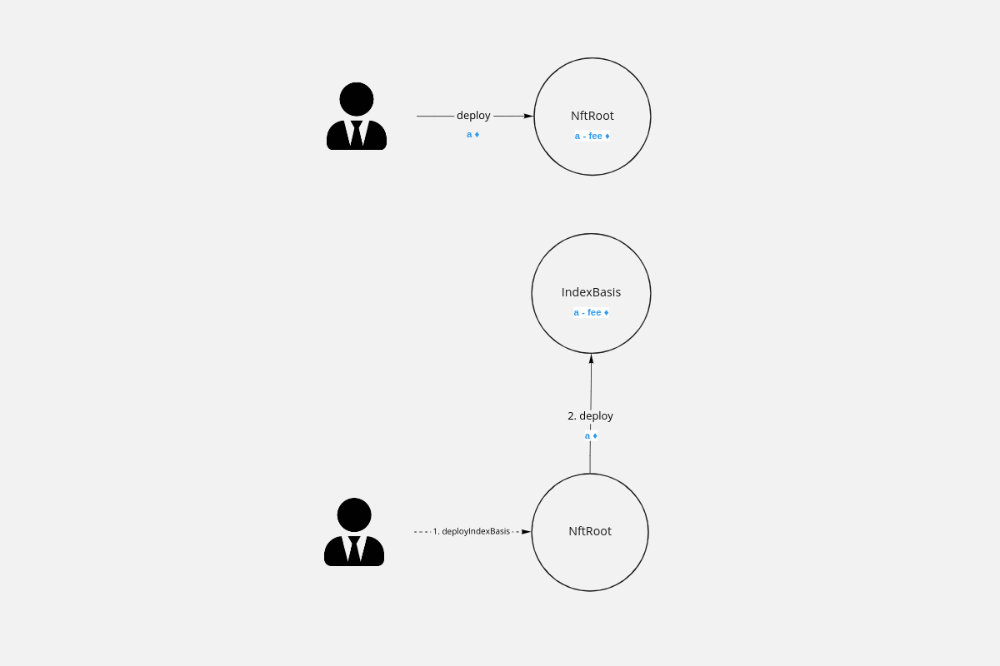
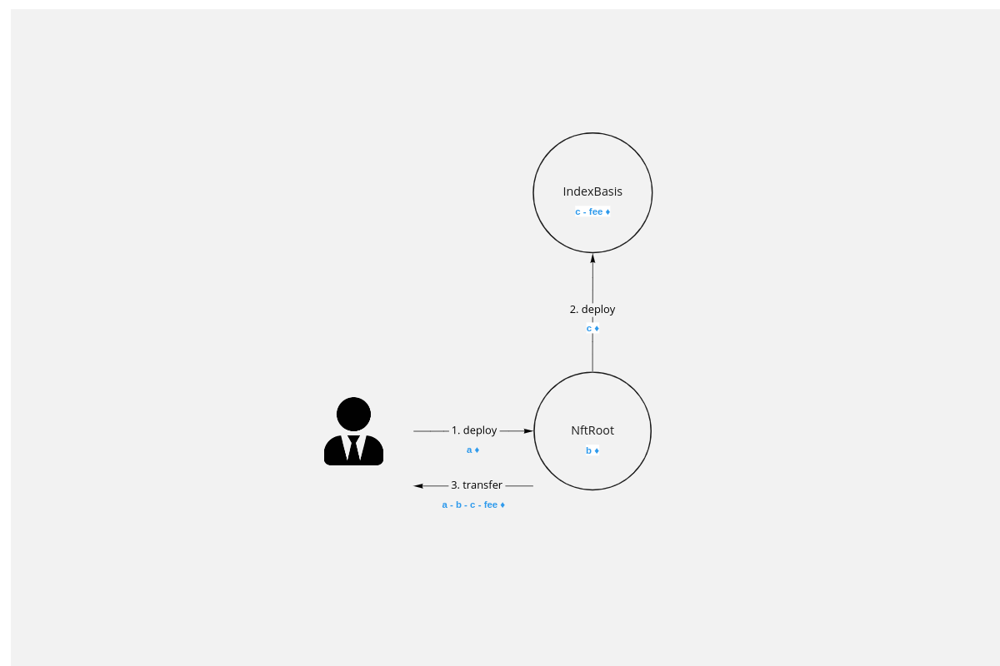
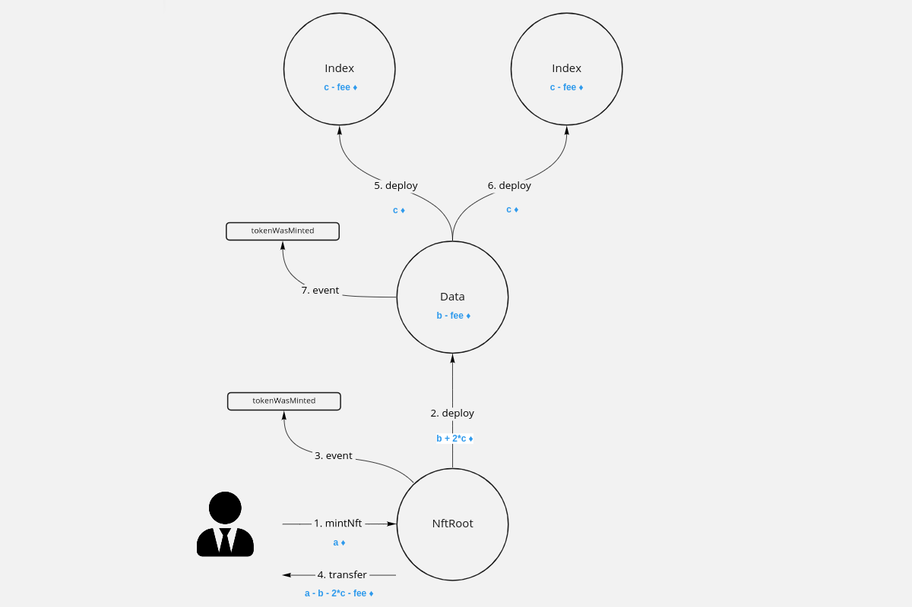
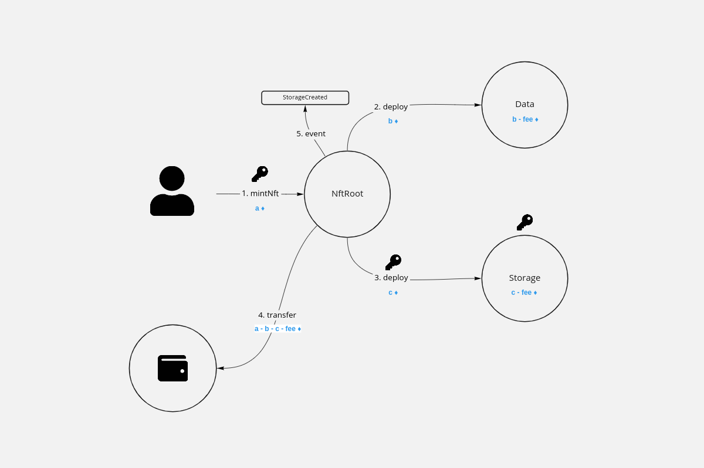
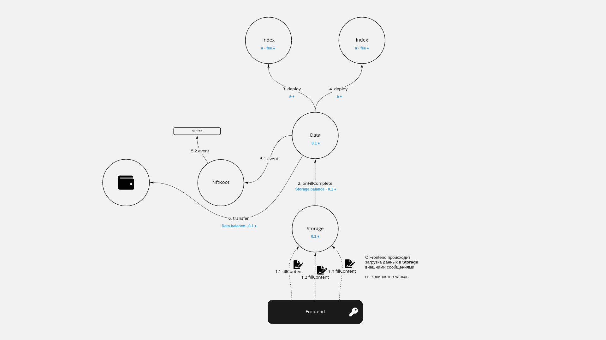

# NFT standard proposals
## Links
* [Itgold tnft](https://github.com/itgoldio/everscale-tnft)
* [Itgold tnft interfaces](https://github.com/itgoldio/everscale-tnft-interfaces)
* [TONLabs TNFT](https://github.com/tonlabs/True-NFT)
* [SolderingArmor nft](https://github.com/SolderingArmor/liquid-nft)

## Комментарии и предложения к написанному коду
### 1. deployIndexBasis
**Проблема**
Почему deployIndexBasis() в контракте NftRoot происходит отдельно от вызова конструктора? Юзкейсы?
[https://github.com/itgoldio/everscale-tnft#class-diagram](https://github.com/itgoldio/everscale-tnft#class-diagram)
[https://github.com/itgoldio/everscale-tnft/blob/master/src/NftRoot.sol#L73](https://github.com/itgoldio/everscale-tnft/blob/master/src/NftRoot.sol#L73)

В оригинальной реализации TNFT индекс BaseIndex деплоится отдельно о создания NftRoot

**Предложение**  
Мы предлагаем деплоить индекс из конструктора NftRoot. Это позволит создавать NftRoot одно транзакцией от пользователя. Эта решение не очень важно, когда NftRoot контракт один, и его деплоит администратор, но становится актуально, когда пользователь может задеплоить множество рутов, какждй из которых создаётся под отдельную коллекцию.

### 2. Минтинг токенов и использование Storage
Ниже схема минтинга токенов смартконтракта от компании itgold

В данной схеме не используется контракт Storage, что не позволяет хранить медиа-контент в блокчейне. Этот подход не является отказоустойчивым. При удалении файла по внешней ссылке, в том числе из IPFS, пользователь не может увидеть даже превью контента, которым обладает.

Ниже показана сжема минтинга токенов с использование контракта Storage. Создание токена происходит несколько этапов:
1. Клиентское приложение создаёт временную пару ключей.
2. Создаются контракты. Одним из них является Storage, методы которого можно вызывать временным ключом. На Storage оставляется некоторое количество денег для оплаты storage fee. 

3. Клиентское приложение вызывает один или несколько раз метод `fillContent()` контракта Storage, используя временные ключи.
4. Транзакция, загружающая последнюю часть контента, вызывает метод `onFillComplete()` контракта Data
5. Деплоятся индесы, и минтинг считается завершённым

### 3. Отправка на нулевой адрес
Зачем нужна защита от отправления токена на нулевой адрес?
[https://github.com/itgoldio/everscale-tnft#data](https://github.com/itgoldio/everscale-tnft#data)

**Предложение**
Если защита всё таки нужна, то вместо `addrTo != address(0)` лушче использовать `addrTo.value != 0`, так как это защитит от оправки на нулевой адрес -1 воркчейна

### 4. getInfoResponsible
[Цитата](https://github.com/itgoldio/everscale-tnft#data) : "Добавлена функция getInfoResponsible для получения информации о nft из других контрактов"
Поддерживаем, но есть предложения по улучшению.

**Предложения:**
- Переименовать метод `getInfoResponsible()` в `getInfo()`, а старый метод `getInfo()` удалить, так как он полностью заменяют друг друга
- Добавить в метод `getInfo()` входящий параметр `TvmCell payload`, который он же будет возвращать в выходных паарметрах. Это нужно для того, чтобы другие контракты могли пользоваться этим методом когда нужно пробрасывать какие-то дополнительные данные.

### 5. Добавление событий tokenWasMinted и ownershipTransferred
[Цитата](https://github.com/itgoldio/everscale-tnft#data): "Добавлены 2 ивента: tokenWasMinted и ownershipTransferred"
Поддерживаем, но есть маленькое предложение.

**Предложение**
Именовать названия событий с большой буквы, исходя из стиля в документации [TON-Solidity](https://github.com/tonlabs/TON-Solidity-Compiler/blob/master/API.md#emit) и [Ethereum](https://docs.soliditylang.org/en/v0.8.11/contracts.html#events)

### 6. Public key vs Internal owner
Реализация itgold использует публичный ключ для изменения праметров контракта. [Пример](https://github.com/itgoldio/everscale-tnft/blob/master/src/NftRoot.sol#L103) 

**Предложение**
Заменить использование публичного ключа на внутренние вызовы. Это позволит вызывать сервисные методы, например, сеттеры NftRoot контракта. Это позволить управлять контрактом через мультисиг, DAO и прочие контракты.

### 7. Добавление в метод `Data.transferOwnership()` параметов `address notificationReceiver`, `TvmCell payload`
[https://github.com/tonlabs/True-NFT/blob/main/1.0/components/true-nft-content/src/Data.sol#L44](https://github.com/itgoldio/everscale-tnft/blob/master/src/Data.sol#L43)
Это необходимо для оповещения других контрактов о передачи прав. Это нужно для on-chain торговли

### 8. Добавление в метод `Index.destruct()` параметр `address gasReceiver`
[https://github.com/tonlabs/True-NFT/blob/main/1.0/components/true-nft-content/src/Index.sol#L41](https://github.com/tonlabs/True-NFT/blob/main/1.0/components/true-nft-content/src/Index.sol#L41)
Сделать возможность получать деньги после уничтожения индекса на любой адрес, а не только на контракт Data. В конечном итоге с контракта Data их также придётся выводить.

### 9. Вызов `Index.destruct()` с указанием `msg.value`
[Пример вызова](https://github.com/tonlabs/True-NFT/blob/main/1.0/components/true-nft-content/src/Data.sol#L49)
При вызове `Index.destruct()` на балансе может быть недостаточно средств виду изменения стоимости газа и списания storage fee.

**Предложение**
Указвать `value` при вызове `Index.destruct()`. `value` должно задаваться параметром.

### 10. Возвращение остатоков от транзакции
Предложение не хранить остатки от транзакций в Data и NftRoot, а возращать остатки на кошелёк, указанный пользователем во всех методах. Это позвлит не лочить деньги на контрактах, а также отказаться от методов, вроде, `withdraw()`. Примеры методов, которые не возвращают деньги:
[https://github.com/tonlabs/True-NFT/blob/main/1.0/components/true-nft-content/src/Data.sol#L44](https://github.com/tonlabs/True-NFT/blob/main/1.0/components/true-nft-content/src/Data.sol#L44)
[https://github.com/itgoldio/everscale-tnft/blob/master/src/Data.sol#L22](https://github.com/itgoldio/everscale-tnft/blob/master/src/Data.sol#L22)

### 11. Во всех методах необходимо добавить возможность указывать, кто будет получать остатки после выполнения всех операция
Пример, где получатель остатков захардкожен - получателем денег из контракта Data является контракт Storage
[https://github.com/tonlabs/True-NFT/blob/main/1.0/components/true-nft-content/src/Data.sol#L41](https://github.com/tonlabs/True-NFT/blob/main/1.0/components/true-nft-content/src/Data.sol#L41)

### 12. Не хардкодить значения, необходимые для деплоя контрактов
По возможность передавать значения параметрами, если это возможно, а не хранить переменными в контракте

### 13. Передавать `TvmCell payload` из контракта `Data` в `Sell` контракт при создании последнего 
`payload` может содержать в себе, как проценты royalty создателя токена, так и дополнительную информацию о себе, которая может влиять на логику работы `Sell` контракта.

## Ошибки в коде
### 1. `deployIndexBasis()`
Баг в [deployIndexBasis]([https://github.com/itgoldio/everscale-tnft/blob/master/src/NftRoot.sol#L73](https://github.com/itgoldio/everscale-tnft/blob/master/src/NftRoot.sol#L73)). Метод не работает. Пропущен tvm.accept(). Этот метод можно вызвать только с правильным публичным ключом. Публичный ключ есть только у external message. External message не имеет message.value, а tvm.accept() не вызывается.

### 2. Перепутаны названия переменных в методе `redeployIndex()`
[https://github.com/itgoldio/everscale-tnft/blob/master/src/Data.sol#L77](https://github.com/itgoldio/everscale-tnft/blob/master/src/Data.sol#L77])  
Эта же опечка имеетеся в TNFT:
* [v1.0](https://github.com/tonlabs/True-NFT/blob/main/1.0/components/true-nft-content/src/Data.sol#L50)
* [v2.0](https://github.com/tonlabs/True-NFT/blob/main/src/Data.sol#L156)

### 3. Обновление индексов
[Цитата](https://github.com/itgoldio/everscale-tnft#data): "Если нам нужно изменить Index контракт - нам нужно передеплоивать Data контракты т.к. в них не заложены возможности установки нового кода index и передеплоивания его."

Текущая реализация решения этой проблемы не работает. [https://github.com/itgoldio/everscale-tnft/blob/master/src/Data.sol#L72](https://github.com/itgoldio/everscale-tnft/blob/master/src/Data.sol#L72).
Если обновить код Index, и вызвать после этот метод `redeployIndex()`, то он не удалит старые индексы. Причина: код Index конракта будет уже новый, у не получится зарезолвить адреса старых Index конрактов, чтобы вызвать у них метод `destruct()`.

**Предложение**
При вызове метода `setIndexCode()` удалять старые индексы и создавать новые

## Принципиальные вопросы
* Приемлим ли токен у которого нет Storage?
* Какие индесы использовать для быстрого поиска контрактов? Ончейн при помощи `Index` контрактов, как это реализовано в TNFT, или офчейн, как это реализовано в graphQL?

## Визуализация взаимодействия между контрактами
[Link](https://miro.com/app/board/uXjVOSBWElw=/?invite_link_id=50900177897)  
Контент показывает разные механики взаимодействия контрактов, в частности реализацию numiz и itgold, а также предложения по улучшению. Контент требует устного пояснения