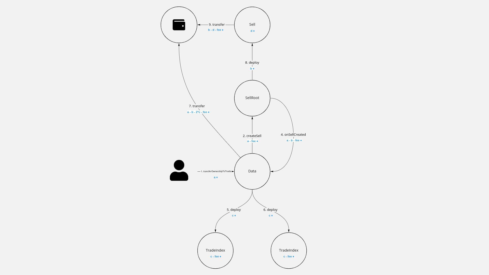
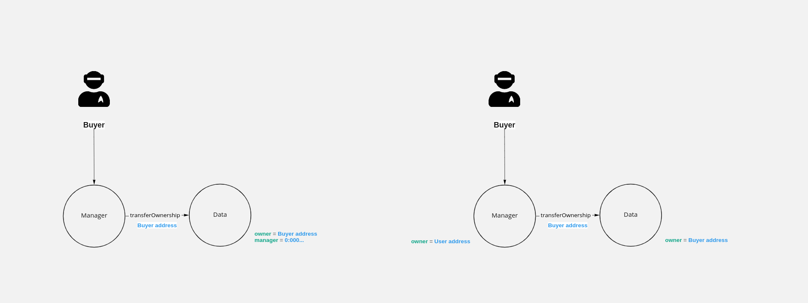

# NFT standard proposals
## Links
* [Itgold tnft](https://github.com/itgoldio/everscale-tnft)
* [Itgold tnft interfaces](https://github.com/itgoldio/everscale-tnft-interfaces)
* [TONLabs TNFT](https://github.com/tonlabs/True-NFT)
* [SolderingArmor nft](https://github.com/SolderingArmor/liquid-nft)

## Комментарии и предложения к написанному коду
### 1. deployIndexBasis
#### Проблема
Почему deployIndexBasis() в контракте NftRoot происходит отдельно от вызова конструктора? Юзкейсы?
* [https://github.com/itgoldio/everscale-tnft#class-diagram](https://github.com/itgoldio/everscale-tnft#class-diagram)
* [https://github.com/itgoldio/everscale-tnft/blob/master/src/NftRoot.sol#L73](https://github.com/itgoldio/everscale-tnft/blob/master/src/NftRoot.sol#L73)

В оригинальной реализации TNFT BasisIndex деплоится отдельно о создания NftRoot

#### Предложение
Деплоить индекс из конструктора NftRoot. Это позволит создавать NftRoot одной транзакцией пользователя. Это решение не очень важно, когда NftRoot контракт один, и его деплоит администратор, но становится актуально, когда пользователь может задеплоить множество рутов, какждый из которых создаётся под отдельную коллекцию

### 2. Минтинг токенов и использование Storage
Ниже схема минтинга токенов смартконтракта от компании itgold

В данной схеме не используется контракт Storage, что не позволяет хранить медиа-контент в блокчейне. Этот подход не является отказоустойчивым. При удалении файла по внешней ссылке, в том числе из IPFS, пользователь не может увидеть даже превью контента, которым обладает

Ниже показана сжема минтинга токенов с использование контракта Storage. Создание токена происходит несколько этапов:
1. Клиентское приложение создаёт временную пару ключей.
2. Создаются контракты. Одним из них является Storage, методы которого можно вызывать временным ключом. На контракте Storage отправляется некоторое количество денег для оплаты storage fee. 

3. Клиентское приложение вызывает один или несколько раз метод `fillContent()` контракта Storage, используя временные ключи
4. Транзакция, загружающая последнюю часть контента, вызывает метод `onFillComplete()` контракта Data
5. Деплоятся индесы, и минтинг считается завершённым

### 3. Отправка на нулевой адрес
Зачем нужна защита от отправления токена на нулевой адрес?
* [https://github.com/itgoldio/everscale-tnft#data](https://github.com/itgoldio/everscale-tnft#data)

#### Предложениея
Если защита всё таки нужна, то вместо `addrTo != address(0)` лушче использовать `addrTo.value != 0`, так как это защитит от оправки на нулевой адрес -1 воркчейна

### 4. getInfoResponsible
[Цитата](https://github.com/itgoldio/everscale-tnft#data) : "Добавлена функция getInfoResponsible для получения информации о nft из других контрактов"

#### Предложения
Поддерживаем изменение, но есть предложения по улучшению
* Переименовать метод `getInfoResponsible()` в `getInfo()`, а старый метод `getInfo()` удалить, так как они полностью заменяют друг друга
* Добавить в метод `getInfo()` входящий параметр `TvmCell payload`, который он же будет возвращать в выходных паарметрах. Это нужно для того, чтобы другие контракты могли пользоваться этим методом когда нужно пробрасывать какие-то дополнительные данные.

### 5. Добавление событий `TokenWasMinted` и `OwnershipTransferred`
[Цитата](https://github.com/itgoldio/everscale-tnft#data): "Добавлены 2 ивента: tokenWasMinted и ownershipTransferred"

#### Предложение
Поддерживаем изменение, но есть маленькое предложение. Именовать названия событий с большой буквы, исходя из стиля в документации [TON-Solidity](https://github.com/tonlabs/TON-Solidity-Compiler/blob/master/API.md#emit) и [Ethereum](https://docs.soliditylang.org/en/v0.8.11/contracts.html#events)  
  
### 6. Public key vs Internal owner
Реализация itgold использует публичный ключ для вызовов методов контрактов. [Пример](https://github.com/itgoldio/everscale-tnft/blob/master/src/NftRoot.sol#L103)  
  
#### Предложение  
Заменить использование публичного ключа на внутренние вызовы. Это позволит вызывать сервисные методы, например, сеттеры NftRoot, контракта из других контрактов. Это позволить управлять токенами через мультисиг, DAO и прочие контракты.

### 7. Добавление в метод `transferOwnership()` контракта Data параметов `address notificationReceiver`, `TvmCell payload`
* [https://github.com/tonlabs/True-NFT/blob/main/1.0/components/true-nft-content/src/Data.sol#L44](https://github.com/itgoldio/everscale-tnft/blob/master/src/Data.sol#L43)

Это необходимо для оповещения других контрактов о передаче прав. Это нужно для on-chain торговли

### 8. Добавление в метод `destruct()` контракта Index параметра `address gasReceiver`
#### Предложение
Необходимо добавить возможность получать деньги после уничтожения индекса на любой адрес, а не только на контракт Data В конечном итоге с контракта Data деньги также придётся выводить. Ниже примеры обновления индексов при вызове метода `transferOwnership()` контракта Data
* [https://github.com/tonlabs/True-NFT/blob/main/1.0/components/true-nft-content/src/Index.sol#L41](https://github.com/tonlabs/True-NFT/blob/main/1.0/components/true-nft-content/src/Index.sol#L41)

1. Истарые индексы:

2. Новые индексы IndexV2

### 9. Вызов `destruct()` контракта Index с указанием `msg.value`
[Пример вызова](https://github.com/tonlabs/True-NFT/blob/main/1.0/components/true-nft-content/src/Data.sol#L49)
При вызове метода `destruct()` контракта Index на балансе может быть недостаточно средств для его уничтожения из-за изменения стоимости газа или списания storage fee

#### Предложение
Добавить параметр `uint128 value` в метод `destruct()` контракта Index. Значение `value`, передаваемое в метод `destruct()`, не должно быть захордкожено, а должно задаваться изменяемым параметром или передаваться извне

### 10. Возвращение остатоков от транзакции
#### Предложение
Не хранить остатки от транзакций в Data и NftRoot, а возращать остатки на кошелёк, который может указать пользователь. Это позволит не лочить деньги на контрактах, а также отказаться от методов, вроде, `withdraw()`. Примеры методов, которые не возвращают деньги:
* [https://github.com/tonlabs/True-NFT/blob/main/1.0/components/true-nft-content/src/Data.sol#L44](https://github.com/tonlabs/True-NFT/blob/main/1.0/components/true-nft-content/src/Data.sol#L44)
* [https://github.com/itgoldio/everscale-tnft/blob/master/src/Data.sol#L22](https://github.com/itgoldio/everscale-tnft/blob/master/src/Data.sol#L22)

Пример вызова метода удаления базового индекса без возращения остатка

С возвращением остатка

### 11. Передавать `TvmCell payload` из контракта `Data` в `Sell` контракт при создании последнего 
`payload` может содержать в себе, как проценты royalty создателя токена, так и дополнительную информацию о себе, которая может влиять на логику работы `Sell` контракта.

### 12. Выставление токена на продажу в один шаг
В оригинальном TNFT и в Numiz реализовано выставление токена на продажу в два этапа:
1. Создание Sell контракта для продажи

2. Передача управления контракта Data контракту Sell

В предложении itgold выставление токена напродажу происходит в один шаг. Это является лучшим решением

#### Предложение
Ипользовать подход itgod

### 13. Поиск токенов, выставленных на продажу
При разработки приложений, использующих NFT, практически всегда встаёт задача поиска токенов, выставленных на продажу. Эта задача решается двумя способами:
1. Off-chain индексатор, который мониторит контракты и знает всё о них
2. On-chain Index контракты

#### Предложение
Использовать on-chain решение - TradeIndex. На изображении, которое мы уже показывали выше, можно увидеть эти контракты. TradeIndex создаются контрактом Data при выставлении токена на продажу. При этом другие индексы остаются нетронутыми. После завершения продажи TradeIndex контракты удаляются

Визуализация процесса продажи NFT с использованием предложенного решения

### 14. Способ передачи управления токеном
Предложено два подхода для передачи управления токеном
1. Токена хранит в себе два параметра: `address owner` и `address manager`. `owner` и `manager` могут распоряжаться токеном в зависимости от того, выставлен токен на продажу или нет. При выставлении контракта на продажу `owner` остаётся прежним, а `manager` меняется на адрес продающего контракта
2. Токена хранит в себе параметр `address owner`. Только `owner` может распоряжаться токеном. При выставлении контракта на продажу `owner` меняется на адрес продающего контракта

Визуализация состояния переменных внутри контракта токена:
1. До выставления токена на продажу

2. После выставление токена на продажу

3. После покупки

4. После отмены продажи

#### Предложение
Использовать второй подход с одним `owner` так так как это не имеет никаких недостатков по сравнению с первым подходом, но при этом упрощает логику управления
  
При использовании первого подхода возникает задача получения токенов пользователя, выставленных на продажу. TradeIndex решает эту проблему. Также эту проблему можно решить off-chain индексатором

## Ошибки в коде
### 1. `deployIndexBasis()`
* [deployIndexBasis](https://github.com/itgoldio/everscale-tnft/blob/master/src/NftRoot.sol#L73)

Метод не работает. Пропущен tvm.accept(). Этот метод можно вызвать только с правильным публичным ключом. Публичный ключ есть только у external message. External message не имеет message.value, а tvm.accept() не вызывается.

### 2. Перепутаны названия переменных в методе `redeployIndex()`
* [https://github.com/itgoldio/everscale-tnft/blob/master/src/Data.sol#L77](https://github.com/itgoldio/everscale-tnft/blob/master/src/Data.sol#L77])
* [TNFT v1.0](https://github.com/tonlabs/True-NFT/blob/main/1.0/components/true-nft-content/src/Data.sol#L50)
* [TNFT v2.0](https://github.com/tonlabs/True-NFT/blob/main/src/Data.sol#L156)

### 3. Обновление индексов
[Цитата](https://github.com/itgoldio/everscale-tnft#data): "Если нам нужно изменить Index контракт - нам нужно передеплоивать Data контракты т.к. в них не заложены возможности установки нового кода index и передеплоивания его."
* [https://github.com/itgoldio/everscale-tnft/blob/master/src/Data.sol#L72](https://github.com/itgoldio/everscale-tnft/blob/master/src/Data.sol#L72).

Текущая реализация решения этой проблемы не работает.  Если обновить код Index, и вызвать после этот метод `redeployIndex()`, то он не удалит старые индексы. Причина: код Index конракта будет уже новый, у не получится зарезолвить адреса старых Index конрактов, чтобы вызвать у них метод `destruct()`.

#### Предложение
При вызове метода `setIndexCode()` удалять старые индексы и создавать новые

## Принципиальные вопросы
* Приемлим ли токен у которого нет Storage?
* Какие индесы использовать для быстрого поиска контрактов? Ончейн при помощи `Index` контрактов, как это реализовано в TNFT, или офчейн, как это реализовано в graphQL?

## Визуализация взаимодействия между контрактами
[Link](https://miro.com/app/board/uXjVOSBWElw=/?invite_link_id=50900177897)  
Контент показывает разные механики взаимодействия контрактов, в частности реализацию numiz и itgold, а также предложения по улучшению. Контент требует устного пояснения